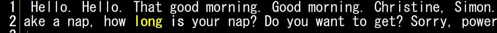
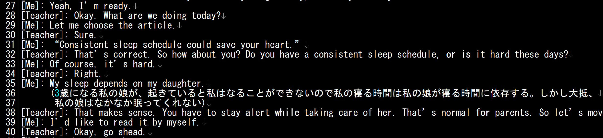

# 私的DMM英会話レビュー方法
1. **DMM英会話を受ける**
2. **レッスンの音声をダウンロード**
3. **ダウンロードした音声をSpeak2Text.pyでテキストに変換**
   
   以下のようなテキストが生成される
   
   
4. **音声を聞きながらそのテキストファイルを編集。**
- 誰がしゃべったかの情報
- ()の中に、日本語でも良いので、どのようなことを言いたかったのか。

  音声を聞いていると、「こういうことが言いたかったのにうまく言えなかった。」「うまく表現する言い方がわからなかったので伝えたかったことと若干意味が違ってしまった。」などがあるので、本来伝えたかった内容を日本語でも良いから記入する。
  
  上記を記入し以下のようなテキストファイルを作成する。
  <br>
  

5. **ChatGPTなどを使い会話テキストを校正する**
<br>EikaiwaPrompt.txt内のプロンプトを使用して編集したテキストの英語をブラッシュアップする。この時()内に記入した日本語は英語に反映される。

6. **ブラッシュアップしたテキストをText2Movie.pyで動画を作成。(有料)**
<br>これはOpenAIのテキスト読み上げAPIを使用するので有料です。これにより、テキストとその音声+無音時間の動画が作成されます。

7. その動画を使用して、シャドーイング、リピーティングを繰り返す。
<br>音声時間でシャードイング、無音時間にリピーティングができます。


以下はText2MovieとSpeak2Textの説明です。

# EikaiwaReview

A Python toolkit for processing English conversation text and creating review materials with AI-generated audio and video content.

## Overview

EikaiwaReview consists of two main tools:

1. **Text2Movie.py** - Converts text conversations into video clips with AI-generated speech
2. **Speak2Text.py** - Transcribes audio files to text using Whisper ASR

## Features

### Text2Movie.py
- 🎯 **Speaker-specific processing** - Extract and process content from specific speakers
- 🎙️ **AI-generated speech** - Uses OpenAI's TTS API with multiple voice options
- 🎬 **Video generation** - Creates video clips with text overlay and synchronized audio
- ⚡ **Batch processing** - Processes multiple sentences and combines them into a single video
- 🔧 **Configurable settings** - Customizable video dimensions, fonts, and processing parameters
- 🧪 **Test mode** - Generate synthetic audio for testing without API costs

### Speak2Text.py
- 🎤 **Audio transcription** - Convert audio files to text using OpenAI's Whisper
- 🌍 **Multiple model sizes** - Support for tiny, base, small, medium, and large models
- ⚡ **Fast processing** - Efficient transcription with timing information
- 📝 **Text output** - Saves transcription to file

## Installation

### Prerequisites
- Python 3.8+
- FFmpeg (for audio/video processing)

### Dependencies

Install required packages:

```bash
pip install openai pillow numpy moviepy textwrap whisper-openai
```

### Environment Setup

Set your OpenAI API key as an environment variable:

```bash
# Windows
set OPENAI_API_KEY=your_api_key_here

# Linux/Mac
export OPENAI_API_KEY=your_api_key_here
```

## Usage

### Text2Movie.py

Convert conversation text to video clips:

```bash
python Text2Movie.py input.txt [suffix]
```

**Parameters:**
- `input.txt` - Input text file with conversation format
- `suffix` (optional) - Prefix for output files

**Input Format:**
```
[Me]: This is my part of the conversation.
[Teacher]: This is the teacher's response.
[Me]: Another sentence from me.
```

**Output:**
- Individual video clips for each sentence
- Combined video file (`{suffix}ALL.mp4`)
- All files saved in `output/` folder

### Speak2Text.py

Transcribe audio files to text:

```bash
python Speak2Text.py audio.wav base
```

**Parameters:**
- `audio.wav` - Path to audio file
- `base` - Whisper model size (tiny, base, small, medium, large)

**Output:**
- `transcription.txt` - Transcribed text file

## Configuration

### Text2Movie Configuration

You can customize the processing by modifying the `Config` class:

```python
config = Config(
  process_speaker="[Me]",      # Speaker to process
  video_width=800,             # Video width
  video_height=600,            # Video height
  font_size=40,                # Text font size
  text_wrap_width=50,          # Characters per line
  min_sentence_length=20,      # Minimum sentence length
  fps=30                       # Video frame rate
)

processor = Text2MovieProcessor(config)
```

### Available Voices

The system randomly selects from these OpenAI TTS voices:
- alloy
- echo
- fable
- onyx
- nova
- shimmer

## Testing

### Test Mode

Enable test mode to generate synthetic audio without using the OpenAI API:

```python
# In Text2Movie.py, set:
TEST_MODE = True
```

This generates a simple sine wave audio for testing purposes.

## File Structure

```
EikaiwaReview/
├── Text2Movie.py           # Main text-to-video processor
├── Speak2Text.py          # Audio transcription tool
├── readme.md              # This file
├── EikaiwaPrompt.txt      # Sample prompt file
└── output/                # Generated video files (created automatically)
    ├── part_0.mp4
    ├── part_1.mp4
    └── ALL.mp4
```

## Examples

### Example 1: Basic Usage

Input file (`conversation.txt`):
```
[Me]: I want to practice my English speaking skills.
[Teacher]: That's great! Let's start with some basic conversations.
[Me]: How should I begin practicing?
```

Command:
```bash
python Text2Movie.py conversation.txt practice_
```

Output:
- `practice_part_0.mp4` - "I want to practice my English speaking skills."
- `practice_part_2.mp4` - "How should I begin practicing?"
- `practice_ALL.mp4` - Combined video

### Example 2: Audio Transcription

```bash
python Speak2Text.py recording.wav medium
```

## Troubleshooting

### Common Issues

1. **FFmpeg not found**
   - Install FFmpeg and ensure it's in your PATH
   - Windows: Download from https://ffmpeg.org/
   - Mac: `brew install ffmpeg`
   - Linux: `sudo apt install ffmpeg`

2. **OpenAI API errors**
   - Verify your API key is set correctly
   - Check your OpenAI account has sufficient credits
   - Enable test mode for development

3. **Font issues**
   - The system tries to use Arial font, falls back to default if unavailable
   - On Linux, install: `sudo apt install fonts-liberation`

4. **Memory issues with large files**
   - Use smaller video dimensions
   - Process files in smaller chunks
   - Use smaller Whisper models for transcription

## API Costs

Text2Movie uses OpenAI's TTS API which charges per character:
- Approximately $0.015 per 1K characters
- Use test mode during development to avoid costs

## Contributing

1. Fork the repository
2. Create a feature branch
3. Make your changes
4. Test thoroughly
5. Submit a pull request
